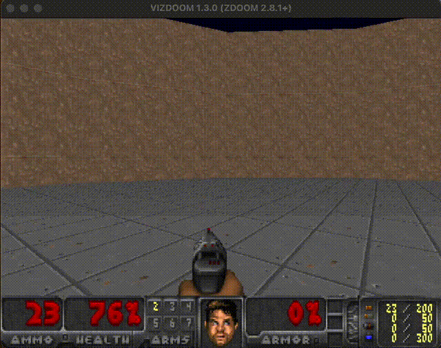
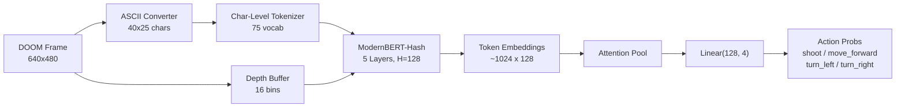

# SauerkrautLM-Doom-MultiVec-1.3M

**A tiny 1.3M parameter model that plays DOOM, outperforming LLMs up to 92,000x its size.**


[](https://huggingface.co/VAGOsolutions/SauerkrautLM-Doom-MultiVec-1.3M)
[](https://huggingface.co/datasets/VAGOsolutions/SauerkrautLM-Doom-MultiVec-31k)

SauerkrautLM-Doom-MultiVec is a ModernBERT encoder with hash embeddings, depth-aware token representations, and an attention pooling classification head. Trained on 31K human gameplay demonstrations, it achieves **178 frags in 10 episodes** (17.8 per episode) in VizDoom's `defend_the_center` scenario, more than all tested LLMs combined (13 frags total). It runs at 31ms per decision on CPU.

[](https://vago-solutions.ai/wp-content/uploads/2026/04/1mio-parameter-plays-DOOM.mp4)
*Click to watch the full demo video*

---

## Benchmark: vs GPT-4o-mini, Nemotron-120B, and more

All agents receive the same ASCII (40x25) + depth input.

| Agent | Params | Avg Survival | Max Survival | Total Frags | Latency |
|-------|--------|-------------|-------------|-------------|---------|
| **SauerkrautLM-Doom-MultiVec-1.3M** | **1.3M** | **388** | **525** | **178** | **31ms** |
| GPT-4o-mini | proprietary | 104 | 228 | 0 | 646ms |
| Nemotron-120B | 120B | 88 | 104 | 3 | 8.9s |
| Qwen3.5-27B | 27B | 87 | 109 | 2 | 13.3s |
| Gemini Flash Lite | proprietary | 81 | 97 | 8 | 920ms |

GPT-4o-mini gets **zero frags** (pure evasion). Our model gets **178 frags**, playing DOOM as intended.

---

## Architecture



---

## Quick Start

```bash
# Install
git clone https://github.com/VAGOsolutions/SauerkrautLM-Doom-MultiVec.git
cd SauerkrautLM-Doom-MultiVec
pip install -e ".[dev]"

# Watch the trained model play
python scripts/play_doom_visual.py --model models/doom-multivec-trained --scenario defend_the_center

# Record your own gameplay (requires VizDoom)
python scripts/record_human.py --scenario defend_the_center --output data/my-demos

# Train a new classifier
python scripts/train_classifier.py --data data/my-demos --output output/my-model --epochs 10

# Run the benchmark
python scripts/benchmark.py --agent multivec --model models/doom-multivec-trained --episodes 10 --realtime
```

---

## Key Features

- **Outplays LLMs at DOOM**: 178 frags vs 0 for GPT-4o-mini, 21x faster inference
- **Ultra-compact**: 1.3M parameters, ~5MB on disk
- **Depth-aware**: Encodes VizDoom depth buffer as learned 16-bin token embeddings
- **ModernBERT-Hash encoder**: Hash embeddings + local/global attention + Flash Attention 2
- **Human-trained**: Trained on 31K human gameplay demonstrations with real depth data
- **Character-level tokenizer**: 75 tokens, no BPE, full spatial granularity
- **Real-time**: 31ms per decision on CPU (35 FPS)
- **Raspberry Pi ready**: Targets ARM Cortex-A53, 512MB RAM, no GPU required

---

## Model Specs

| Property | Value |
|---|---|
| Parameters | 1,319,300 (~1.3M) |
| Hidden Size | 128 |
| Layers | 5 (local + global attention) |
| Attention Heads | 4 (head dim = 32) |
| FFN Size | 512 |
| Depth Bins | 16 |
| Vocab Size | 75 (char-level) |
| Actions | 4 (shoot, move_forward, turn_left, turn_right) |
| Model Size (FP32) | ~5 MB |
| Inference Latency | 31ms (CPU) |

---

## Project Structure

```
doom_multivec/
  src/doom_multivec/
    ascii/          # Frame-to-ASCII conversion
    model/          # ModernBERT-Hash model, tokenizer, classifier
    doom/           # VizDoom engine wrapper
    training/       # Dataset builder, action mapping
    inference/      # Real-time inference engine
  scripts/          # CLI scripts (train, benchmark, play, record, export)
  models/           # Base models + trained checkpoint
  docs/             # MkDocs Material documentation
  paper/            # LaTeX paper + figures
```

---

## Documentation

Full documentation is available in the `docs/` directory:

```bash
pip install mkdocs-material "mkdocstrings[python]"
mkdocs serve
```

- [Installation](docs/getting-started/installation.md)
- [Quick Start](docs/getting-started/quickstart.md)
- [Architecture](docs/guide/architecture.md)
- [Data Pipeline](docs/guide/data-pipeline.md)
- [Training](docs/guide/training.md)
- [Benchmark](docs/guide/benchmark.md)
- [Inference](docs/guide/inference.md)
- [Deployment](docs/guide/deployment.md)

---

## Paper

See `paper/doom_multivec.pdf` for the full paper:

> **Playing DOOM with 1.3M Parameters: Specialized Small Models vs Large Language Models for Real-Time Game Control**
>
> David Golchinfar (VAGO Solutions), Daryoush Vaziri (H-BRS), Alexander Marquardt (NAIST)

---

## Requirements

- Python 3.10+
- PyTorch, Transformers
- VizDoom (for gameplay and data collection)
- OpenAI SDK (optional, for LLM benchmarks)

---

## License

Apache 2.0

DOOM is a registered trademark of id Software LLC. This project is not affiliated with or endorsed by id Software.

## Citation

```bibtex
@misc{SauerkrautLM-Doom-MultiVec,
  title={SauerkrautLM-Doom-MultiVec-1.3M: Playing DOOM with 1.3M Parameters},
  author={David Golchinfar and Daryoush Vaziri and Alexander Marquardt},
  url={https://huggingface.co/VAGOsolutions/SauerkrautLM-Doom-MultiVec-1.3M},
  year={2026}
}
```
