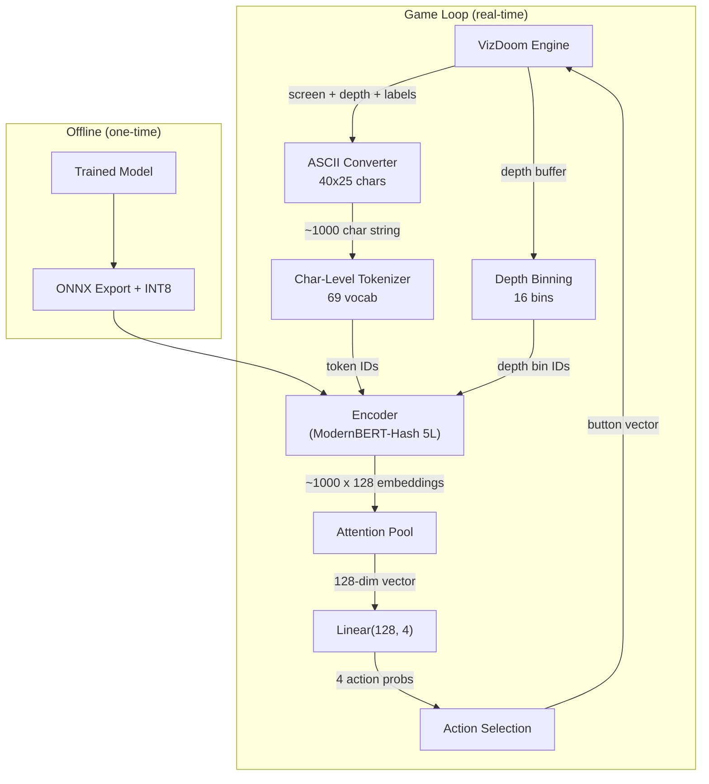
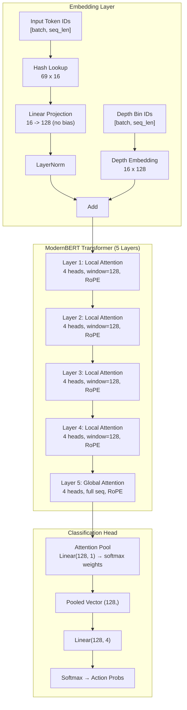
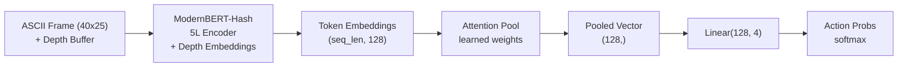
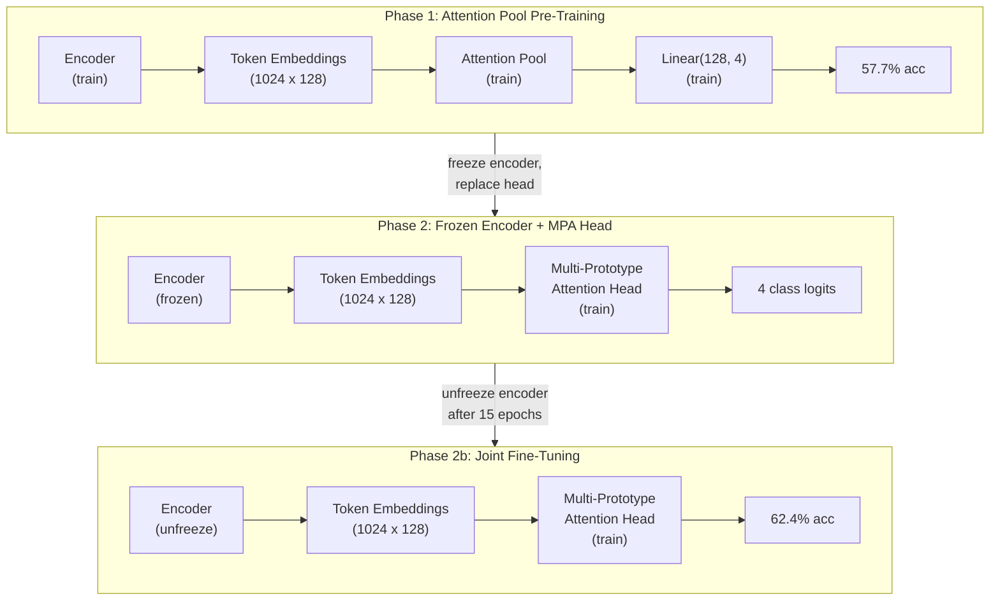
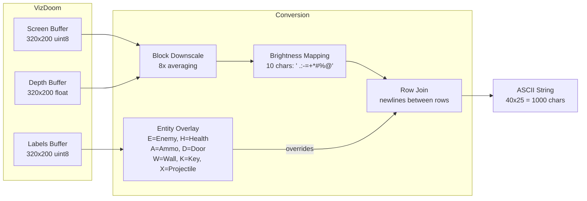
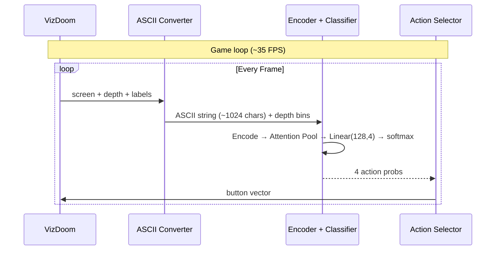

# Architecture

DOOM MultiVec is a multi-vector classifier built on ModernBERT with hash embeddings and depth embeddings. It encodes ASCII representations of DOOM game frames into per-token embeddings, pools them via learned attention, and classifies into 4 actions through a linear head.

---

## System Overview



---

## Model Architecture

The model has three main components: hash embeddings + depth embeddings, a 5-layer ModernBERT transformer, and an attention pooling classification head. The encoder produces per-token 128-dim embeddings which are pooled and classified into 4 actions.



---

## Architecture Evolution

### Phase 1: MaxSim Knowledge Distillation (abandoned)

The original design was a ColBERT-style late interaction model. ASCII frames were encoded into per-token embeddings, and MaxSim scored each frame against 6 natural-language action query embeddings (e.g., "shoot fire weapon attack enemy"). Training used KL-divergence on soft teacher scores from PPO agent action decomposition.

**Why it collapsed**: With a 69-character vocabulary, the query texts for different actions share too many common characters (spaces, 'e', 't', etc.). MaxSim's per-token maximum matching latched onto these shared tokens rather than discriminating between actions. All queries received similar scores for any given frame.

### Phase 2: MaxSim with Learned Prototypes (abandoned)

To avoid the shared-character problem, learned prototype embeddings replaced natural-language queries. Each action had a small set of trainable vectors. This helped marginally but still suffered from score collapse -- the prototype vectors converged to similar regions of embedding space.

### Phase 3: Attention Pool Classifier (current)

The final architecture preserves the multi-vector encoder but replaces MaxSim entirely with a learned pooling and classification head:

1. The ModernBERT-Hash encoder produces per-token embeddings as before
2. **Depth embeddings** (16 bins) are added to token embeddings, encoding VizDoom depth buffer distance
3. An **attention pooling** layer learns which tokens matter, collapsing the sequence into a single 128-dim vector
4. A **linear classifier** (`Linear(128, 4)`) maps the pooled vector to 4 action logits
5. Action probabilities are obtained via softmax over the logits

This keeps the rich token-level representations from the multi-vector encoder while avoiding the MaxSim scoring collapse. The attention pooling learns to weight game-relevant tokens (entities, spatial features) more heavily than background characters.



The 4 actions are: **shoot**, **move_forward**, **turn_left**, **turn_right**. Strafe actions were removed as they provided minimal gameplay benefit and added classification difficulty.

### Phase 4: Staged Training — Attention Pool to Multi-Prototype Head

The attention pool classifier (Phase 3) achieves 57.7% accuracy but collapses the full token sequence into a single 128-dim vector before classification. This discards the token-level structure that a multi-vector approach should exploit. Phase 4 introduces a **staged training** strategy that transitions from the attention pool to a Multi-Prototype Attention (MPA) head — a true multi-vector classifier where each class prototype cross-attends to all 1,024 frame tokens.

**Phase 1 — Attention pool pre-training.** Train the full model (encoder + attention pool + linear head) end-to-end on human demonstrations, as in Phase 3. This produces a well-trained encoder whose per-token embeddings already carry meaningful spatial and semantic information. The attention pool acts as scaffolding: it forces the encoder to produce globally useful token representations even though pooling itself is a bottleneck.

**Phase 2 — Head replacement with frozen encoder.** Freeze the encoder weights. Remove the attention pool and linear head. Attach a Multi-Prototype Attention head: each of the 4 action classes owns a small set of learned prototype vectors (e.g., 4 prototypes per class, each 128-dim). Each prototype cross-attends to the full token sequence via scaled dot-product attention, producing a prototype-specific summary. Class logits are computed by summing attention-weighted similarities across prototypes. Train only the MPA head parameters for 15 epochs so the prototypes learn to specialize without destabilizing the encoder.

**Phase 2b — Joint fine-tuning.** After 15 epochs with a frozen encoder, unfreeze the encoder and continue training end-to-end at a reduced learning rate. This allows the encoder to co-adapt with the MPA head, sharpening token embeddings for prototype-level discrimination.

**Results:** 57.7% (attention pool) → **62.4%** (staged multi-proto), a +2.6 pp improvement. The staged approach avoids the cold-start problem: training the MPA head from scratch (without pre-trained encoder embeddings) leads to slow convergence and lower final accuracy.

This is now a **true multi-vector classifier** — each prototype interacts with all 1,024 frame tokens via cross-attention, preserving token-level spatial structure throughout the classification decision.



---

## Related Work

The Multi-Prototype Attention head draws on several lines of work in learned query mechanisms, prototype-based classification, and multi-vector retrieval. The table below situates our approach within this landscape.

| Approach | Paper | Similarity | Key Difference |
|----------|-------|-----------|----------------|
| Perceiver | Jaegle et al., 2021 | Learned queries cross-attend to inputs | Shared queries, not class-specific |
| Set Transformer PMA | Lee et al., 2019 | Learned seed vectors pool input sets | Task-agnostic, not per-class |
| ProtoPNet | Chen et al., 2019 | Per-class prototypes match spatial features | Hard max instead of soft attention |
| Slot Attention | Locatello et al., 2020 | Learned slots attend to features | Iterative refinement, competitive normalization |
| BLIP-2 Q-Former | Li et al., 2023 | Learned queries cross-attend to frozen encoder | Shared queries + self-attention among queries |
| ColBERT MaxSim | Khattab & Zaharia, 2020 | Token-level matching with sum over query tokens | Text-derived queries, hard max |

**Perceiver** and **Set Transformer PMA** both learn a fixed set of query vectors that cross-attend to variable-length inputs, but their queries are shared across all classes — the learned vectors are task-agnostic pooling seeds rather than class-specific prototypes.

**ProtoPNet** assigns per-class prototypes that match against spatial feature patches, which is closest to our design. However, ProtoPNet uses hard maximum similarity (the best-matching patch determines the prototype's activation), whereas our MPA head uses soft cross-attention over all tokens, allowing each prototype to aggregate evidence from the full frame.

**Slot Attention** learns a set of slots that iteratively compete to explain input features via softmax normalization across slots. Our prototypes do not compete; each class's prototypes attend independently, and competition occurs only at the final logit level.

**BLIP-2 Q-Former** uses learned queries that cross-attend to a frozen vision encoder's outputs, similar to our Phase 2 setup. The key difference is that Q-Former queries are shared (not class-specific) and include self-attention layers among queries, adding complexity we avoid.

**ColBERT MaxSim** is the original inspiration for this project's multi-vector approach. ColBERT computes token-level similarity between query and document tokens, then takes the maximum similarity per query token and sums across queries. Our MPA head replaces ColBERT's text-derived query tokens with learned prototypes and replaces hard max with soft attention, addressing the score collapse observed in Phase 1–2 of this project's evolution.

Our approach combines class-specific learned prototypes (from ProtoPNet) with soft cross-attention (from Perceiver/Set Transformer) for game action classification. The staged training strategy — attention pool pre-training followed by multi-prototype head replacement — is a practical contribution that addresses the cold-start problem of training multi-vector heads from scratch.

---

## Classification Head

The classification head adds minimal parameters to the ~1.3M-parameter encoder:

| Component | Parameters |
|---|---|
| Depth Embedding (`Embedding(16, 128)`) | 2,048 |
| Attention weight (`Linear(128, 1)`) | 129 |
| Classifier (`Linear(128, 4)`) | 516 |
| **Head total** | **2,693** |

!!! note "Multi-vector encoder is preserved"
    The encoder still produces per-token 128-dim embeddings. The attention pool and linear head are added on top. The encoder is trained jointly from scratch on human gameplay demonstrations.

---

### Parameter Budget

| Component | Parameters | Proportion |
|---|---|---|
| Hash Embedding (69 x 16 lookup) | 1,104 | < 0.1% |
| Hash Projection (16 x 128 linear) | 2,048 | 0.2% |
| Hash LayerNorm (128) | 256 | < 0.1% |
| Depth Embedding (16 x 128) | 2,048 | 0.2% |
| Embedding Subtotal | **5,456** | **~0.4%** |
| Transformer (5 layers, H=128, FFN=512) | ~1,295,000 | ~99.4% |
| Attention Pool (Linear(128, 1)) | 129 | < 0.1% |
| Classifier (Linear(128, 4)) | 516 | < 0.1% |
| **Total** | **~1.3M** | **100%** |

!!! note "Depth embeddings"
    The VizDoom depth buffer is quantized into 16 bins per token position. Each bin maps to a 128-dim embedding that is added to the hash embedding output. This gives the model explicit distance information -- ASCII brightness is a rough proxy for distance, but depth embeddings provide ground-truth range data from the game engine.

---

## ASCII Conversion Pipeline

DOOM frames are converted to ASCII text that preserves both spatial layout and semantic content.



**Resolution**: 40 characters wide by 25 rows = 1,000 characters per frame, plus 24 newline characters as row separators = 1,024 characters total.

**Brightness mapping**: The 10-character ramp ` .:-=+*#%@` maps pixel brightness (or inverted depth) from dark (space) to bright (`@`).

**Entity overlay**: When VizDoom's labels buffer identifies a game entity at a position, the entity character overrides the brightness character:

| Character | Entity | Examples |
|---|---|---|
| `E` | Enemy | Zombieman, Imp, Cacodemon, Cyberdemon |
| `H` | Health | Medikit, Stimpack, Soulsphere |
| `A` | Ammo | Clip, Shell, Backpack, weapons |
| `D` | Door | Door objects |
| `W` | Wall | Wall/obstacle |
| `K` | Key | Blue/Red/Yellow card or skull |
| `X` | Projectile | Explosions, projectiles |

**Example ASCII frame** (simplified):

```
 .:-=+*##%@@@%##*+=:-. .:-=+*##%@@@%##
 .:-=+*##%@@@%##*+=:-. .:-=+*##%@@@%##
 ..::--==  EE  ==--::.. ..::--==++**##
 ...:::  EEEEEE  :::... ...:::---===++
 ......         H  ...... ......:::-==
########################################
########################################
```

---

## Action Mapping

DOOM MultiVec classifies each frame into one of 4 base actions:

| Action Index | Action | Description |
|---|---|---|
| 0 | `shoot` | Fire weapon at enemy |
| 1 | `move_forward` | Move forward |
| 2 | `turn_left` | Rotate left |
| 3 | `turn_right` | Rotate right |

Strafe actions (`strafe_left`, `strafe_right`) were removed from the original 6-action set. They provided minimal gameplay benefit in the defend_the_center scenario and added classification difficulty -- the model struggled to distinguish strafe from turn in ASCII frames.

At inference time, the classifier's softmax probabilities enable **composite actions** by combining the top-2 predictions when they come from different categories (e.g., `move_forward + shoot` or `turn_left + shoot`). See [Inference: Composite Action Selection](inference.md#composite-action-selection) for details.

### Training Data Sources

Training data comes from **human gameplay demonstrations** recorded via `scripts/record_human.py`. The human plays in VizDoom's SPECTATOR mode while the script captures:

- ASCII frames (40x25 characters)
- Depth buffer bins (16 bins per token)
- Action scores (soft labels across 4 actions)

The current training set contains **31K frames** with real depth data. See [Data Pipeline: Human Gameplay Recording](data-pipeline.md#human-gameplay-recording) for details.

---

## Inference Loop



No pre-computed query embeddings or MaxSim scoring are needed -- the classifier produces action probabilities in a single forward pass.

**Measured latency** (CPU):

| Step | Latency |
|---|---|
| Frame capture (VizDoom) | ~5 ms |
| ASCII conversion + depth binning | ~3 ms |
| Tokenization | ~1 ms |
| Encoder + attention pool + classifier | ~18 ms |
| Action selection | < 1 ms |
| **Total** | **~29 ms** |

---

## Design Decisions

### Why Hash Embeddings?

With only 69 vocabulary tokens, a standard embedding table (69 x 128 = 8,832 params) is already tiny. Hash embeddings (69 x 16 + 16 x 128 = 3,152 params) save ~64% on the embedding layer specifically. The real value is architectural consistency: the same `ModernBertHashModel` class works at any vocabulary size, making it easy to scale up or swap tokenizers later.

### Why Character-Level Tokenization?

Every ASCII character carries distinct meaning:

- **Brightness characters** (` .:-=+*#%@`) encode distance/wall density
- **Entity characters** (`E`, `H`, `A`, `D`, `W`, `K`, `X`) identify game objects
- **Newlines** (`\n`) preserve row boundaries (2D spatial structure)

BPE or WordPiece would merge common patterns like `...` or `###` into single tokens, destroying the per-character spatial granularity that the attention pooling layer relies on for weighting game-relevant tokens.

### Why Depth Embeddings?

ASCII brightness is a rough proxy for distance, but it conflates wall color, lighting, and range into a single channel. The VizDoom depth buffer provides ground-truth distance per pixel. By quantizing depth into 16 bins and adding a learned embedding per bin to each token, the model gets explicit range information. This is a key advantage over LLMs in the benchmark -- they only see brightness, not depth.

### Why 5 Layers?

Five transformer layers provide sufficient capacity for the 4-action classification task while keeping inference fast. The first 4 layers use local attention (window=128) for efficient processing of ~1000-token sequences. The final layer uses global attention to aggregate spatial information across the entire frame. On CPU, the 5-layer model runs in ~29ms per frame.

### Why ModernBERT?

ModernBERT offers two key features for this use case:

1. **Local + global attention**: Layers 1-4 use local attention (window=128), reducing compute for the ~1000-token frame sequences. Layer 5 uses global attention to aggregate information across the full frame.
2. **RoPE positional encoding**: No learned position embeddings -- one fewer parameter table and better extrapolation to slightly different sequence lengths.

### Why Attention Pooling Instead of CLS Token?

A CLS token approach would require the first token to carry all frame information after the transformer layers. Attention pooling instead learns a weighted combination of all token embeddings, allowing the model to dynamically focus on the most relevant tokens (e.g., enemy positions, nearby walls). This outperformed both CLS-token and mean-pooling approaches in our experiments.

### Why Human Demonstrations?

The original pipeline used PPO agent replays from GameNGen. Switching to human gameplay demonstrations (recorded via `scripts/record_human.py`) provides higher-quality action labels that better reflect human-like play strategies. The human data also includes real depth buffer readings from VizDoom, which the HuggingFace datasets lack. The current training set is 31K frames -- small but effective for the 4-action task.
