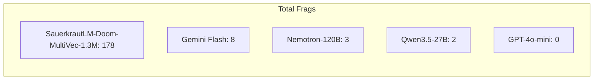

# Benchmark: MultiVec Classifier vs Large Language Models

We benchmark our tiny 1.3M parameter MultiVec Classifier against state-of-the-art
Large Language Models playing DOOM. All agents receive the same ASCII representation
of the game frame and must choose from the same 4 actions.

## Setup

### Scenario
- **defend_the_center**: Enemies approach from all directions in a circular arena
- Episode timeout: 2100 tics (~60 seconds)
- frame_skip=4 (each decision covers 4 game tics, ~114ms real-time)

### Agents

| Agent | Type | Parameters | Input |
|-------|------|-----------|-------|
| **SauerkrautLM-Doom-MultiVec-1.3M** | Our model (ModernBERT-Hash + Attention Pool + Classifier) | 1.3M | ASCII (40x25) + Depth (16-bin embeddings) |
| GPT-4o-mini | OpenAI fast model | proprietary | ASCII (40x25) + Depth (text grid 0-9) |
| Nemotron-120B | NVIDIA reasoning model | 120B | ASCII (40x25) + Depth (text grid 0-9) |
| Qwen3.5-27B | Alibaba reasoning model | 27B | ASCII (40x25) + Depth (text grid 0-9) |
| Gemini Flash Lite | Google fast model | proprietary | ASCII (40x25) + Depth (text grid 0-9) |

### Fairness

All LLM agents receive:

- The **same 40x25 ASCII frame** as our model (no smaller resolution)
- The **same system prompt** with no strategy hints — only ASCII encoding explained
- The ability to output **composite actions** (e.g., `turn_left+shoot`)
- **Model-specific inference parameters** as recommended on their HuggingFace model cards:
    - Qwen3.5: temperature=0.6, top_p=0.95 (thinking mode)
    - Nemotron: temperature=0.6, top_p=0.95 (reasoning mode)
    - GPT-4o-mini: temperature=0.3
    - Gemini Flash Lite: temperature=1.0, top_p=0.95
- Sufficient token limits for reasoning (4000 max_completion_tokens for thinking models, 200 for standard models)

All agents receive both ASCII and depth information. Our model encodes depth as learned
16-bin embeddings added to token representations. LLMs receive depth as a text grid
(digits 0-9, where 0=near and 9=far) appended to the ASCII frame in the prompt.
The depth encoding method differs but the information content is equivalent.

### LLM System Prompt

All LLMs receive this identical system prompt:

```
You are an AI agent playing the classic game DOOM. Each turn you receive
the current game view as ASCII art.

ASCII encoding:
- Brightness characters (dark to bright): " .:-=+*#%@"
  Brighter characters (like # % @) indicate objects that are CLOSER to you.
  Darker characters (like . : -) indicate distant or empty areas.

Available actions (respond with one or combine two with '+'):
  shoot, move_forward, turn_left, turn_right

Examples of valid responses:
  shoot
  move_forward
  turn_left+shoot
  move_forward+turn_right

Respond with ONLY your chosen action(s). No explanation.
```

### Episode Counts

Our model and faster LLMs (GPT-4o-mini, Gemini Flash Lite) were evaluated over 10 episodes.
Reasoning models with high per-frame latency were evaluated over fewer episodes due to
cost and time constraints:

- Nemotron-120B: 5 episodes (~11s per frame, ~30 min total)
- Qwen3.5-27B: 3 episodes (~17s per frame, ~1h total)

We report **Total Frags** rather than per-episode averages to account for differing episode counts.

### Composite Action Selection

Our model applies a relative shoot threshold: `shoot` is added if
`P(shoot) > 0.75 * P(top_action)`. Compatible movement and rotation actions are
combined if the second action exceeds P > 0.15. LLMs receive equivalent composite
action support through their prompt, which explicitly allows responses like
`turn_left+shoot`. Both sides can output multi-action combinations; only the
mechanism differs (threshold-based vs prompt-based).

### Metrics

- **Avg Survival**: Average steps survived per episode (higher = better)
- **Max Survival**: Longest single episode (525 = timeout, survived the full 60-second episode)
- **Total Frags**: Enemies killed across all episodes (tracked via positive reward signals)
- **Latency**: Time per decision (lower = more responsive)

### Frag Tracking

Frags are tracked via VizDoom's reward signal: each `make_action()` call returns +1 per enemy killed.
Only positive rewards are counted as frags. The `-1` death penalty is excluded.

!!! note
    Frag counts in the benchmark are lower than in visual gameplay because the benchmark
    runs headless without real-time pacing. In visual tests, our model achieves 19-23 frags
    per episode in defend_the_center.

## Results

### Real-time Benchmark (frame_skip=4)

Each agent decides every 4 game tics (~114ms real-time). Game settings match training
conditions: 640x480 resolution, HUD enabled, real-time pacing. Max survival = 525 steps
(full 60-second episode at frame_skip=4).

All agents receive the same information: ASCII frame (40x25) + depth map (0-9 per character).
Our model encodes depth as learned embeddings; LLMs receive depth as a text grid in the prompt.

| Agent | Params | Episodes | Avg Survival | Max Survival | Total Frags | Latency |
|-------|--------|----------|-------------|-------------|-------------|---------|
| **SauerkrautLM-Doom-MultiVec-1.3M** | **1.3M** | **10** | **388** | **525** | **178** | **31ms** |
| GPT-4o-mini | proprietary | 10 | 104 | 228 | 0 | 646ms |
| Nemotron-120B | 120B | 5 | 88 | 104 | 3 | 8.9s |
| Qwen3.5-27B | 27B | 3 | 87 | 109 | 2 | 13.3s |
| Gemini Flash Lite | proprietary | 10 | 81 | 97 | 8 | 920ms |



### Key Findings

**Dominant frag performance**: MultiVec achieves **178 frags** in 10 episodes (17.8 per
episode) — more than all LLMs combined (13 total). This is a 14x advantage over all
LLMs combined. The model actively navigates toward enemies, aims, and fires.

**Survival + frags**: Our model leads in both survival (388 avg) and frags (178 total).
GPT-4o-mini survives 104 steps on average but scores **zero frags** across 10 episodes,
relying purely on evasive movement.

**Latency**: Our model runs at **31ms per decision** — real-time at 35 FPS. The fastest LLM
(GPT-4o-mini at 646ms) is 21x slower. Reasoning models are 287-429x slower.

**Cost efficiency**: LLM API calls cost \$0.001-0.05 per frame. Running all LLM benchmarks
cost ~\$15-30 in API fees. Our model runs for free on local hardware indefinitely.

### Fair-Mode Benchmark (frame_skip=20)

To control for latency advantages, we also ran a "fair mode" benchmark with frame_skip=20
(each decision covers 20 game tics, ~571ms real-time). This gives slower LLMs more time
between decisions.

| Agent | Params | Episodes | Avg Survival | Max Survival | Total Frags | Latency |
|-------|--------|----------|-------------|-------------|-------------|---------|
| **SauerkrautLM-Doom-MultiVec-1.3M** | **1.3M** | 10 | **33** | **46** | **10** | **29ms** |
| GPT-4o-mini | proprietary | 10 | 30 | 55 | 0 | 620ms |
| Gemini Flash Lite | proprietary | 10 | 16 | 18 | 5 | 1.1s |
| Qwen3.5-27B | 27B | 3 | 15 | 18 | 1 | 12.0s |
| Nemotron-120B | 120B | 5 | 14 | 20 | 0 | 26.7s |

**Key observations from fair mode**:

- MultiVec leads in both survival (33 steps) and frags (10) even when latency advantage is reduced
- GPT-4o-mini again survives nearly as long (30 steps) but with zero frags, confirming its purely evasive behavior
- Gemini Flash Lite achieves 5 frags, the best LLM frag count, likely because its faster inference (1.1s) allows more responsive gameplay
- Reasoning models (Nemotron, Qwen) remain too slow even at the reduced pace, with 0-1 frags

### Why LLMs Struggle

1. **Latency kills**: In a real-time game, 13 seconds per decision means enemies
   have walked up and started shooting before you react.

2. **ASCII is not natural language**: LLMs are trained on text, not spatial ASCII art.
   They struggle to map brightness patterns to 3D spatial awareness.

3. **No memory**: Each frame is a new prompt. LLMs cannot build a mental map of
   the arena or track enemy positions across frames.

4. **Depth as text is less effective**: Both agents receive depth data, but our model
   encodes it as learned 16-bin embeddings fused with token representations. LLMs receive
   depth as a text grid of digits — harder to reason about spatially.

## Reproducing the Benchmark

```bash
# Install dependencies
pip install openai

# Run our model (fast, free, matched visual settings)
python scripts/benchmark.py --agent multivec --episodes 10 --realtime

# Run GPT-4o-mini
export OPENAI_API_KEY="your-key"
python scripts/benchmark.py --agent gpt4mini --episodes 5 --realtime

# Run OpenRouter models
export OPENROUTER_API_KEY="your-key"
python scripts/benchmark.py --agent openrouter --episodes 3

# Results are saved to benchmark_*.json
```

## Video Demo

Our MultiVec model playing defend_the_center. The model navigates toward enemies,
turns to face them, and shoots — achieving 23 frags in a single episode.

<video controls width="100%">
  <source src="../assets/doom_gameplay.mp4" type="video/mp4">
  Your browser does not support the video tag.
</video>
