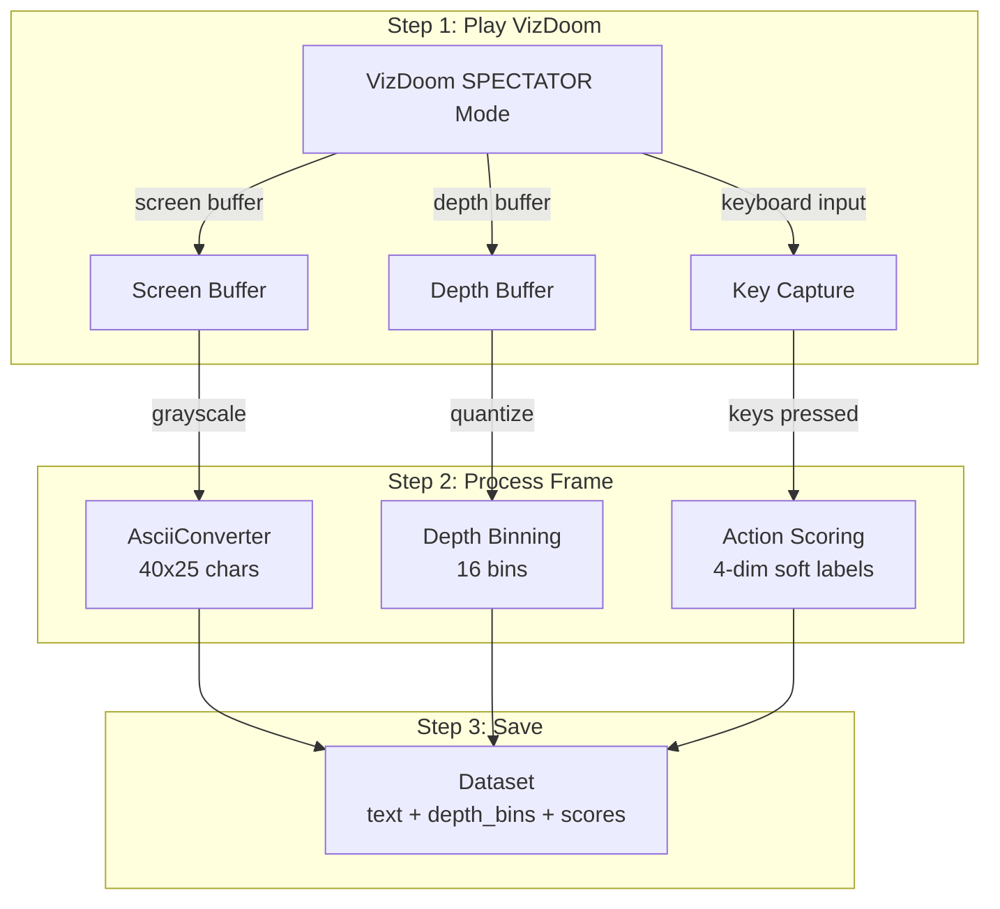
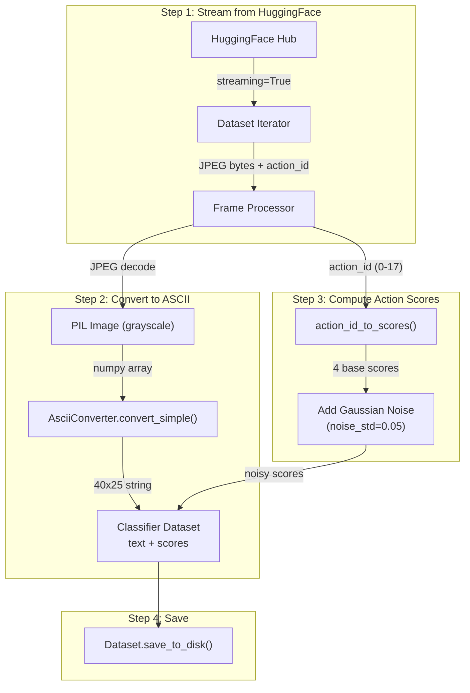
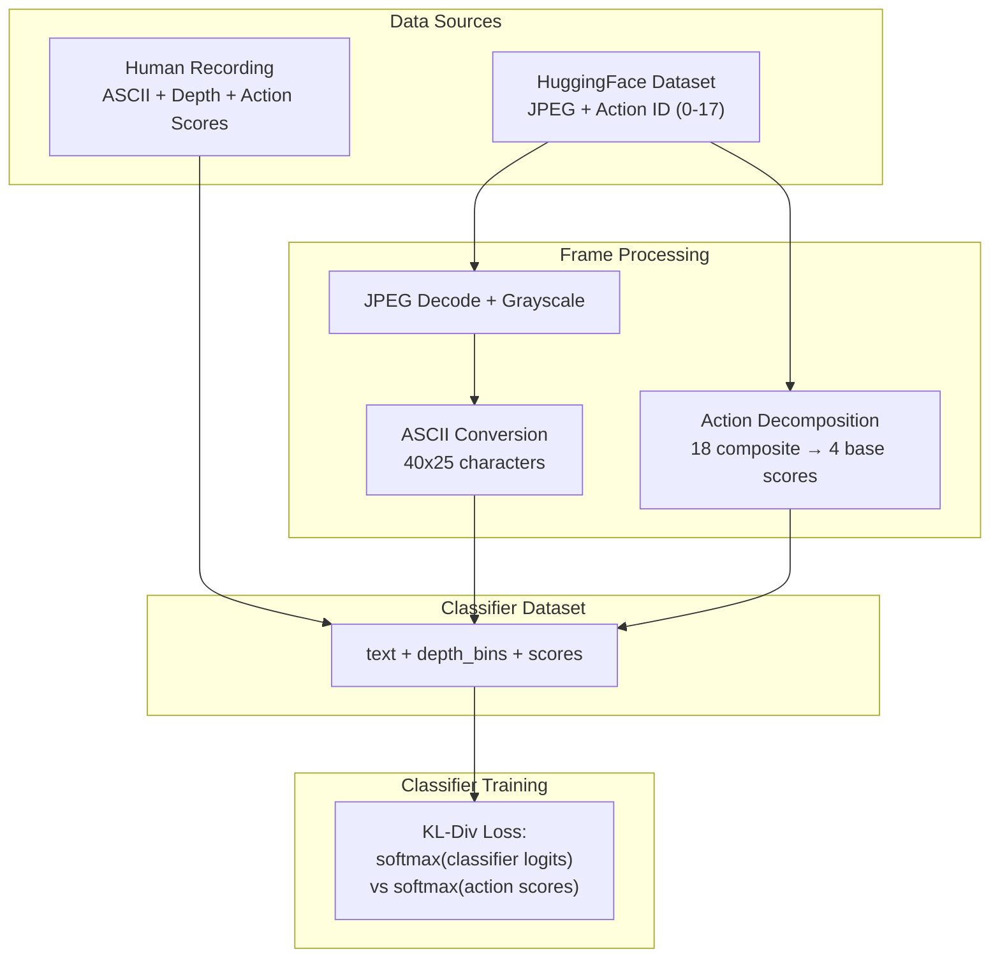

# Data Pipeline

The data pipeline provides training data for the DOOM MultiVec classifier. The primary source is **human gameplay demonstrations** recorded via `scripts/record_human.py`, which captures ASCII frames, depth buffer data, and action scores. HuggingFace datasets from GameNGen PPO agent replays are also supported as a secondary source.

---

## Human Gameplay Recording

The recommended way to collect training data is recording your own gameplay in VizDoom's SPECTATOR mode. This produces the highest-quality data with real depth buffer readings.

### Recording Command

```bash
python scripts/record_human.py \
    --scenario defend_the_center \
    --output data/human-demos \
    --frame-skip 4
```

This opens a VizDoom window where you play using keyboard controls. The script captures every frame_skip-th frame and records:

- **ASCII frame**: 40x25 character representation of the game view
- **Depth bins**: VizDoom depth buffer quantized into 16 bins per token position
- **Action scores**: Soft scores across 4 actions based on which keys you pressed

### Recording Controls

| Key | Action |
|---|---|
| `SPACE` or `CTRL` | Shoot |
| `W` or `UP` | Move forward |
| `LEFT` | Turn left |
| `RIGHT` | Turn right |

### Data Format

Each recorded frame produces a training sample with:

| Field | Type | Description |
|---|---|---|
| `text` | string | 40x25 ASCII frame (~1024 characters) |
| `depth_bins` | list[int] | 16-bin quantized depth per token position |
| `scores` | list[float] | 4-dim soft action scores |

The current training set contains **31K frames** from human gameplay, achieving 57.7% accuracy on the 4-action classification task.

---

## HuggingFace Datasets (Secondary)

DOOM MultiVec also supports pre-recorded DOOM gameplay datasets from HuggingFace. These were originally created for the GameNGen project and contain JPEG-encoded frames with action labels from a PPO-trained agent. Note that these datasets lack depth buffer data.

| Dataset | Frames | Scenario | HuggingFace ID |
|---|---|---|---|
| VizDoom 50 Episodes (skip 4) | ~50,000 | Deathmatch | `arnaudstiegler/vizdoom-50-episodes-skipframe-4` |
| VizDoom Deathmatch 10K | ~10,000 | Deathmatch | `dokster/vizdoom-deathmatch-10k` |

!!! tip "Which data source to use"
    Human gameplay recordings with `scripts/record_human.py` are recommended because they include real depth data and human-quality action labels. HuggingFace datasets are useful for augmenting training data volume but lack depth information.

---

## HuggingFace Data Collection Command

The `scripts/collect_data.py` script processes HuggingFace datasets into classifier training format:

```bash
python scripts/collect_data.py \
    --mode classifier \
    --dataset arnaudstiegler/vizdoom-50-episodes-skipframe-4 \
    --max-frames 50000 \
    --scan-limit 250000 \
    --stride 5 \
    --ascii-width 40 \
    --ascii-height 25 \
    --noise-std 0.05 \
    --seed 42 \
    --output data/doom-cls-50k
```

### Command Options

| Option | Default | Description |
|---|---|---|
| `--mode` | `classifier` | Output format: `classifier` for the current pipeline |
| `--dataset` | `arnaudstiegler/vizdoom-50-episodes-skipframe-4` | HuggingFace dataset identifier |
| `--max-frames` | `50000` | Maximum frames to process |
| `--scan-limit` | `250000` | Total frames to scan from the dataset before applying stride selection |
| `--stride` | `5` | Take every Nth frame from the scanned range (stride sampling) |
| `--ascii-width` | `40` | ASCII frame width in characters |
| `--ascii-height` | `25` | ASCII frame height in characters |
| `--noise-std` | `0.05` | Gaussian noise added to teacher scores for robustness |
| `--seed` | `42` | Random seed for reproducibility |
| `--split` | `train` | Dataset split to load |
| `--output` | `data/doom-cls-50k` | Output directory |

### Stride Sampling

By default, the script uses **stride-based sampling** (`--scan-limit 250000 --stride 5`) rather than taking the first N frames sequentially. This is critical for data quality.

**The problem with sequential sampling**: The VizDoom 50-episode dataset stores frames in episode order. If you take the first 50,000 frames sequentially, you only cover roughly the first 10 of 50 episodes. The model trains on a narrow slice of gameplay -- the same maps, the same early-game situations -- and misses the diversity of encounters across the full dataset.

**How stride sampling fixes this**: With `--scan-limit 250000 --stride 5`, the script scans 250,000 frames but only keeps every 5th frame, yielding 50,000 frames spread evenly across all 50 episodes. This ensures the training data includes the full range of gameplay situations: different maps, enemy types, health states, and tactical scenarios.

| Strategy | Frames collected | Episodes covered | Diversity |
|---|---|---|---|
| Sequential (`--max-frames 50000`) | 50,000 | ~10 of 50 | Low -- only early episodes |
| Stride (`--scan-limit 250000 --stride 5`) | 50,000 | All 50 | High -- spread across all episodes |

!!! warning "Always use stride sampling for production datasets"
    Sequential sampling is acceptable for small test datasets (a few hundred frames), but any dataset intended for real training should use stride sampling to avoid episode bias.

---

## Pipeline Steps

### Human Recording Pipeline



### HuggingFace Collection Pipeline



---

## Teacher Scoring

### Human Demonstrations

For human gameplay recordings, action scores are derived directly from the keys pressed during recording. If the human presses multiple keys simultaneously (e.g., forward + shoot), both actions receive high scores. The 4-dim score vector uses soft labels (not hard one-hot), providing richer supervision for the KL-divergence loss.

### HuggingFace Dataset Decomposition

For HuggingFace datasets, the original action ID (0-17) per frame is decomposed into soft scores for 4 base actions. Strafe actions are folded into their nearest equivalent (strafe_left maps to turn_left, strafe_right maps to turn_right).

| Action ID | Active Base Actions | shoot | move_fwd | turn_L | turn_R |
|---|---|---|---|---|---|
| 0 | turn_left | 0.05 | 0.05 | **0.85** | 0.05 |
| 1 | turn_right | 0.05 | 0.05 | 0.05 | **0.85** |
| 8 | move_forward | 0.05 | **0.85** | 0.05 | 0.05 |
| 9 | forward + turn_left | 0.05 | **0.85** | **0.85** | 0.05 |
| 17 | shoot | **0.85** | 0.05 | 0.05 | 0.05 |

Active components receive a score of 0.85, inactive components receive 0.05.

### Score Noise

Gaussian noise (default std=0.05) is added to teacher scores before saving, clipped to [0, 1]. This prevents the model from overfitting to the exact 0.85/0.05 score boundary and improves generalization.

### Why This Approach?

- **Not hard labels**: A composite action like "forward + turn_left" (ID 9) should teach the model that *both* `move_forward` and `turn_left` are appropriate, not just one class label.
- **Not an LLM teacher**: Generating 50K+ teacher annotations with an LLM would be expensive and unreliable for spatial ASCII reasoning.
- **Not RL from scratch**: Training an RL agent changes the project scope entirely. The PPO agent actions from GameNGen provide a free, high-quality signal.
- **Soft scores**: The 0.85/0.05 split (not 1.0/0.0) gives the KD loss a gradient even for well-classified examples, improving training stability.

---

## Classifier Dataset Format

The saved dataset is a HuggingFace `Dataset` with the following columns:

| Column | Type | Description |
|---|---|---|
| `text` | string | 40x25 ASCII frame (~1024 characters) |
| `depth_bins` | list[int] | Depth bin IDs per token (16 bins, 0-15) |
| `scores` | list[float] | 4-dim soft action scores [shoot, move_fwd, turn_L, turn_R] |

For human recordings, `depth_bins` contains real VizDoom depth data. For HuggingFace datasets, `depth_bins` may be zeros (no depth available).

### Example Row

| `text` | `depth_bins` | `scores` |
|---|---|---|
| ` .:-=+*#%@...` (40x25) | `[3, 3, 5, 7, 8, 10, 12, 14, ...]` | `[0.05, 0.85, 0.05, 0.05]` |

---

## Expected Output

### Human Recordings

| Metric | Expected Value |
|---|---|
| Frames per ~5 min session | ~2,000-3,000 |
| Current training set | 31K frames |
| Document length (chars) | ~1,024 (40 x 25 + 24 newlines) |
| Depth data | Real VizDoom depth buffer |
| Dataset on disk | ~50-100 MB |

### HuggingFace Collection (50K frames)

| Metric | Expected Value |
|---|---|
| Total frames processed | ~50,000 |
| Episodes covered | All 50 (with stride sampling) |
| Actions | 4 |
| Document length (chars) | ~1,024 (40 x 25 + 24 newlines) |
| Depth data | Not available (zeros) |
| Dataset on disk | ~200-300 MB |

!!! note "Processing time"
    The `collect_data.py` script streams frames from HuggingFace and processes them sequentially. Expect ~15-30 minutes for 50K frames depending on network speed. Progress is logged every 5,000 frames.

---

## Small Test Dataset

For development and quick iteration, create a small test dataset:

```bash
python scripts/collect_data.py \
    --mode classifier \
    --dataset arnaudstiegler/vizdoom-50-episodes-skipframe-4 \
    --max-frames 500 \
    --output data/doom-cls-test-500
```

This takes under a minute and produces enough data for a training smoke test. Stride sampling is not necessary for small test datasets -- sequential sampling is fine when you only need a few hundred frames to verify the pipeline works.

---

## How Training Data Works

This section explains the full data pipeline end-to-end: where the data comes from, how action scores are constructed, and why multi-vector classification works.

### Data Sources

**Primary: Human gameplay demonstrations** recorded via `scripts/record_human.py` in VizDoom SPECTATOR mode. Each frame includes:

- **ASCII frame**: 40x25 character representation
- **Depth bins**: Real VizDoom depth buffer quantized into 16 bins
- **Action scores**: 4-dim soft labels from keyboard input

**Secondary: HuggingFace VizDoom datasets** from GameNGen PPO agent replays. Each sample contains a JPEG frame and action ID (0-17) that is decomposed into 4-dim soft scores. These lack depth data.

### Action Decomposition (HuggingFace Data)

The 18 GameNGen actions are **composite** -- each one maps to one or more simultaneous button presses. We decompose them into soft scores across 4 base actions (strafe is removed):

| Action ID | Composite Meaning | Base Actions |
|---|---|---|
| 0 | turn_left | turn_left only |
| 8 | move_forward | move_forward only |
| 9 | forward + turn_left | move_forward + turn_left |
| 17 | shoot | shoot only |

- **Active components** receive a score of **0.85**
- **Inactive components** receive a score of **0.05**
- **Gaussian noise** (std=0.05) is added to each score for robustness, clipped to [0, 1]

### Why Multi-Vector Classification Works Here

**The problem with single-vector models**: A single-vector approach compresses the entire 40x25 ASCII frame (1,024 characters) into ONE fixed-size vector. This loses spatial information -- the model cannot distinguish between "enemy on the left" (turn left) and "enemy on the right" (turn right) because both produce similar aggregate statistics.

**How the multi-vector encoder helps**: Our model keeps **~1,024 token-level vectors** (128-dim each), one per ASCII character. The attention pooling layer then learns to weight game-relevant tokens more heavily:

- `E` (entity marker) tokens get high attention weights when the model needs to decide between shoot and turn
- Spatial position of high-attention tokens encodes directionality (left vs right)
- Depth embeddings add explicit distance information per token

The model learns spatial patterns through this attention-weighted classification:

- `E` centered in frame + close depth --> "shoot" scores high
- `#` wall characters directly ahead --> "turn" scores high
- Open space ahead + far depth --> "move_forward" scores high

**No RL needed**: We learn directly from human gameplay demonstrations. The classifier architecture turns action selection into a direct classification problem using the rich spatial representations from the multi-vector encoder.

### Data Flow Diagram


