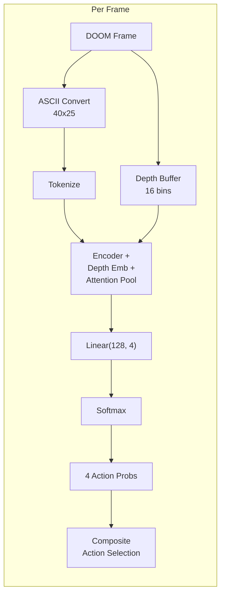

# Inference

The inference pipeline converts a trained DOOM MultiVec model into a real-time game-playing system. The classifier approach uses a single forward pass through the encoder and classification head to produce action probabilities -- no pre-computed query embeddings or MaxSim scoring required.

---

## How Inference Works (Classifier)



### Loading the Classifier

```python
import torch
from doom_multivec.model.classifier import DoomMultiVecClassifier
from transformers import AutoTokenizer

model_path = "models/doom-multivec-trained"
tokenizer = AutoTokenizer.from_pretrained(model_path)
model = DoomMultiVecClassifier(model_path, pool_mode='attention')
model.load_state_dict(torch.load(f"{model_path}/model.pt", map_location='cpu'))
model.eval()
```

### Predicting Actions

Action probabilities are obtained via softmax over the classifier logits:

```python
encoded = tokenizer(
    ascii_frame,
    return_tensors='pt',
    max_length=1100,
    padding='max_length',
    truncation=True,
)

with torch.no_grad():
    result = model(encoded['input_ids'], encoded['attention_mask'])
    probs = torch.softmax(result['logits'], dim=-1)[0].cpu().numpy()

action_names = DoomMultiVecClassifier.ACTION_NAMES
for i, name in enumerate(action_names):
    print(f"  {name:15s}: {probs[i]:.3f}")
```

No query embeddings or MaxSim computation needed -- the classification head directly outputs per-action scores.

---

## Action Selection Strategies

### Single Best Action

Pick the action with the highest softmax probability:

```python
import numpy as np

action_names = DoomMultiVecClassifier.ACTION_NAMES
best_idx = np.argmax(probs)
best_action = action_names[best_idx]
```

### Composite Action Selection

DOOM supports simultaneous button presses. The classifier's softmax probabilities enable combining the top actions from different categories when both are confident:

```python
sorted_idx = np.argsort(probs)[::-1]
top_action = action_names[sorted_idx[0]]
buttons = list(ACTION_TO_BUTTONS[top_action])

# Combine with second action if confident and from a different category
if probs[sorted_idx[1]] > 0.12:
    second_action = action_names[sorted_idx[1]]

    movement = {'move_forward'}
    rotation = {'turn_left', 'turn_right'}
    combat = {'shoot'}

    top_cat = 'move' if top_action in movement else ('rot' if top_action in rotation else 'combat')
    sec_cat = 'move' if second_action in movement else ('rot' if second_action in rotation else 'combat')

    if top_cat != sec_cat:
        second_buttons = ACTION_TO_BUTTONS[second_action]
        buttons = [max(a, b) for a, b in zip(buttons, second_buttons)]
```

This produces composite actions like `move_forward+turn_left` or `move_forward+shoot` when the model is confident about actions from different categories. The 0.12 probability threshold prevents noise from triggering spurious combinations.

| Category | Actions | Can Combine With |
|---|---|---|
| Movement | `move_forward` | Rotation, Combat |
| Rotation | `turn_left`, `turn_right` | Movement, Combat |
| Combat | `shoot` | Movement, Rotation |

!!! tip "Composite actions are key"
    Single-action mode (`--no-composite`) causes stilted gameplay. Composite actions let the model move and turn simultaneously, which matches how a human plays DOOM.

## Legacy: MaxSim-Based Inference

The original MaxSim approach pre-computed 6 action query embeddings at startup and scored each frame against them. This is preserved in the codebase but is not recommended due to the score collapse problem described in [Architecture: Architecture Evolution](architecture.md#architecture-evolution).

<details>
<summary>MaxSim inference (deprecated)</summary>

At startup, the 6 action query texts are encoded once:

```python
from doom_multivec.model.colbert_wrapper import load_doom_colbert, ACTION_TEXTS, ACTION_NAMES

model = load_doom_colbert("models/doom-multivec-trained")  # legacy model path
query_embs = model.encode(ACTION_TEXTS, is_query=True)
```

For each frame, MaxSim computes per-action scores:

```python
import numpy as np

def maxsim(query_emb, doc_emb):
    sim = query_emb @ doc_emb.T  # (n_q, n_d)
    return sim.max(axis=1).sum()

scores = {}
for i, action_name in enumerate(ACTION_NAMES):
    q_emb = np.array(query_embs[i])
    d_emb = np.array(doc_embs[0])
    scores[action_name] = maxsim(q_emb, d_emb)
```

</details>

---

## ONNX Export

For deployment on Raspberry Pi, export the trained model to ONNX and quantize to INT8:

### Export

```python
import torch
from transformers import AutoModel

# Load the trained model
model = AutoModel.from_pretrained("models/doom-multivec-trained", trust_remote_code=True)
model.eval()

# Create dummy input
dummy_input_ids = torch.randint(0, 69, (1, 1024))
dummy_attention_mask = torch.ones(1, 1024, dtype=torch.long)

# Export to ONNX
torch.onnx.export(
    model,
    (dummy_input_ids, dummy_attention_mask),
    "doom_classifier.onnx",
    input_names=["input_ids", "attention_mask"],
    output_names=["logits"],
    dynamic_axes={
        "input_ids": {0: "batch", 1: "seq_len"},
        "attention_mask": {0: "batch", 1: "seq_len"},
        "last_hidden_state": {0: "batch", 1: "seq_len"},
    },
    opset_version=17,
)
```

!!! note "Classifier head"
    The ONNX export should include the full pipeline: encoder + depth embeddings + attention pool + linear classifier. The output is 4 action logits, not raw token embeddings.

### INT8 Quantization

```python
from onnxruntime.quantization import quantize_dynamic, QuantType

quantize_dynamic(
    "doom_classifier.onnx",
    "doom_classifier_int8.onnx",
    weight_type=QuantType.QInt8,
)
```

Expected sizes:

| Format | Size |
|---|---|
| FP32 ONNX | ~5 MB |
| INT8 ONNX | ~1.5 MB |

### ONNX Runtime Inference

```python
import onnxruntime as ort
import numpy as np

# Create session
session = ort.InferenceSession("doom_classifier_int8.onnx")

# Tokenize input
input_ids = np.array([[2, 7, 8, 9, 10, ...]], dtype=np.int64)  # tokenized ASCII frame
attention_mask = np.ones_like(input_ids)

# Run inference
outputs = session.run(
    ["logits"],
    {"input_ids": input_ids, "attention_mask": attention_mask},
)

# outputs[0] shape: (1, 4) -- action logits
# Apply softmax to get action probabilities
logits = outputs[0][0]
probs = np.exp(logits - logits.max()) / np.exp(logits - logits.max()).sum()
```

---

## Performance Benchmarks

### Latency (per frame)

| Hardware | Precision | Classifier Latency | Total (with ASCII + depth) |
|---|---|---|---|
| NVIDIA RTX 3090 | FP16 | ~2 ms | ~5 ms |
| Apple M2 Pro | FP32 | ~8 ms | ~12 ms |
| CPU (benchmark) | FP32 | ~18 ms | ~29 ms |
| Raspberry Pi Zero 2W | INT8 | ~120 ms | ~135 ms |

No MaxSim or query embedding computation is needed -- the classifier produces action probabilities in a single forward pass.

### Memory

| Component | RAM Usage |
|---|---|
| Model weights (FP32) | ~5 MB |
| Frame embedding (~1024 x 128, float32) | ~512 KB |
| Attention pool + classifier working memory | ~1 KB |
| **Total inference** | **~6 MB** |

---

## Full Inference Example

End-to-end classifier inference:

```python
import torch
import numpy as np
from doom_multivec.model.classifier import DoomMultiVecClassifier
from doom_multivec.ascii.converter import AsciiConverter
from transformers import AutoTokenizer

# Load model
model_path = "models/doom-multivec-trained"
tokenizer = AutoTokenizer.from_pretrained(model_path)
model = DoomMultiVecClassifier(model_path, pool_mode='attention')
model.load_state_dict(torch.load(f"{model_path}/model.pt", map_location='cpu'))
model.eval()

# Initialize ASCII converter
converter = AsciiConverter(width=40, height=25)

def select_action(screen_buffer):
    """Select the best action for a DOOM frame."""
    # Convert to ASCII
    gray = np.mean(screen_buffer, axis=2).astype(np.uint8)
    ascii_frame = converter.convert_simple(gray)

    # Tokenize and predict
    encoded = tokenizer(
        ascii_frame, return_tensors='pt',
        max_length=1100, padding='max_length', truncation=True,
    )
    with torch.no_grad():
        result = model(encoded['input_ids'], encoded['attention_mask'])
        probs = torch.softmax(result['logits'], dim=-1)[0].cpu().numpy()

    action_names = DoomMultiVecClassifier.ACTION_NAMES
    return action_names[np.argmax(probs)], dict(zip(action_names, probs.tolist()))
```
