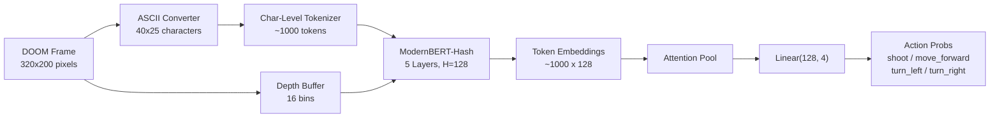
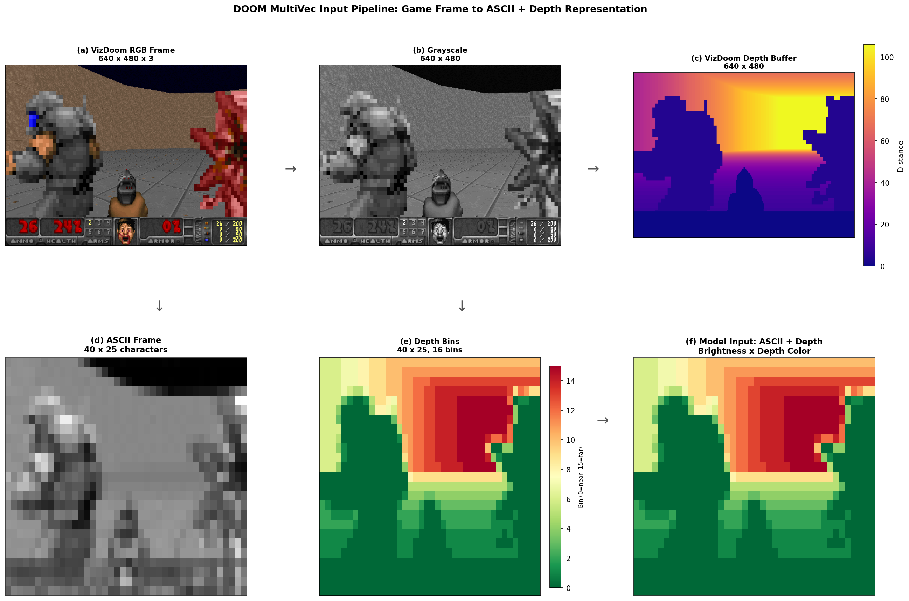
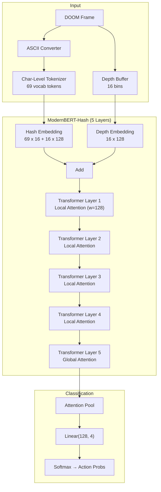

# SauerkrautLM-Doom-MultiVec

**A tiny multi-vector classifier (~1.3M parameters) that plays DOOM on a Raspberry Pi Zero 2W.**

SauerkrautLM-Doom-MultiVec is a multi-vector encoder with an attention pooling classification head that understands ASCII representations of DOOM game frames and selects actions in real time. Trained on human gameplay demonstrations with depth data, it runs inference in 29ms on CPU and outperforms LLMs including GPT-4o-mini, Nemotron-120B, and Qwen3.5-27B at playing DOOM.

---

## How It Works

DOOM frames are converted to ASCII art, the VizDoom depth buffer is encoded as depth embeddings (16 bins), and a tiny ModernBERT encoder produces per-token embeddings. An attention pooling layer collapses these into a single vector, and a linear classification head maps it to 4 action probabilities.



### Input Pipeline


*Game frame to ASCII + depth representation: (a) VizDoom RGB, (b) grayscale, (c) depth buffer, (d) ASCII brightness, (e) depth bins, (f) combined model input.*

### The Multi-Vector Advantage

Traditional single-vector embeddings compress an entire frame into one fixed-size vector, losing spatial information. SauerkrautLM-Doom-MultiVec keeps one embedding **per token** (per ASCII character), preserving spatial layout. The attention pooling layer then learns which tokens matter most -- enabling the model to detect that an enemy character `E` is centered (shoot), that a wall `#` is ahead (turn), or that open space lies ahead (move forward). Depth embeddings add distance information that ASCII brightness alone cannot capture.

---

## Benchmark: vs GPT-4o-mini, Nemotron-120B, and more

Our 1.3M parameter model **outperforms all tested LLMs** at playing DOOM,
including models with 1000x+ more parameters.

All agents receive ASCII + depth information.

| Agent | Params | Avg Survival | Max Survival | Total Frags | Latency |
|-------|--------|-------------|-------------|-------------|---------|
| **SauerkrautLM-Doom-MultiVec-1.3M** | **1.3M** | **388** | **525** | **178** | **31ms** |
| GPT-4o-mini | proprietary | 104 | 228 | 0 | 646ms |
| Nemotron-120B | 120B | 88 | 104 | 3 | 8.9s |
| Qwen3.5-27B | 27B | 87 | 109 | 2 | 13.3s |
| Gemini Flash Lite | proprietary | 81 | 97 | 8 | 920ms |

MultiVec gets **178 frags** in 10 episodes (17.8 per episode) — more than all LLMs combined (13 total). GPT-4o-mini gets **zero frags** (pure evasion).
See the [full benchmark](guide/benchmark.md) for details and methodology.

<video controls width="100%" style="border-radius: 8px; margin-top: 16px;">
  <source src="assets/SauerkrautLM-Doom-MultiVec-Demo.mp4" type="video/mp4">
  Your browser does not support the video tag.
</video>
<p style="text-align: center; color: gray; font-size: 0.9em;">SauerkrautLM-Doom-MultiVec-1.3M playing defend_the_center</p>

---

## Key Features

- **Outplays LLMs at DOOM**: 178 frags vs 0 for GPT-4o-mini, 21x faster inference
- **Ultra-compact**: 1.3M parameters, ~5MB on disk, 4-action classifier
- **Depth-aware**: Encodes VizDoom depth buffer as token-level depth embeddings
- **Multi-vector encoder**: ModernBERT-Hash with attention pooling classification head
- **Human-trained**: Trained on human gameplay demonstrations with real depth data
- **Character-level tokenizer**: Every ASCII character is a token -- full spatial granularity
- **Real-time**: 29ms per decision on CPU -- playable at 35 FPS
- **Raspberry Pi ready**: Targets ARM Cortex-A53, 512MB RAM, no GPU required

---

## Model Specifications

| Property | Value |
|---|---|
| Total Parameters | ~1.3M |
| Encoder (ModernBERT-Hash, 5 layers) | ~1.3M |
| Attention Pool + Classifier Head | ~902 |
| Depth Embeddings (16 bins x 128) | 2,048 |
| Hidden Size | 128 |
| Layers | 5 |
| Attention Heads | 4 (head dim = 32) |
| FFN Intermediate Size | 512 |
| Hash Projections | 16 |
| Depth Bins | 16 |
| Actions | 4 (shoot, move_forward, turn_left, turn_right) |
| Vocabulary Size | 69 (char-level ASCII) |
| Max Sequence Length | 1,200 tokens |
| Model Size (FP32) | ~5 MB |
| Measured Inference Latency | 29ms (CPU) |

---

## Quick Start

```bash
# Record human gameplay demonstrations (with depth data)
python scripts/record_human.py --scenario defend_the_center --output data/human-demos

# Or collect from HuggingFace datasets
python scripts/collect_data.py --mode classifier --max-frames 10000 --output data/doom-cls-10k

# Train the classifier
python scripts/train_classifier.py --data data/doom-cls-10k --output output/my-classifier --epochs 5 --batch-size 64

# Watch it play
python scripts/play_doom_visual.py --model models/doom-multivec-trained --scenario defend_the_center
```

See the [Installation Guide](getting-started/installation.md) and [Quick Start](getting-started/quickstart.md) for full details.

---

## Architecture at a Glance



See the [Architecture Guide](guide/architecture.md) for a detailed breakdown with design rationale.

---

## Project Structure

```
doom_multivec/
  src/doom_multivec/
    ascii/          # Frame-to-ASCII conversion
    model/          # ModernBERT-Hash model, tokenizer, classifier
    doom/           # VizDoom engine wrapper
    training/       # Classifier training, human data, action mapping
    inference/      # Real-time inference engine
  scripts/          # CLI scripts (create model, collect data, train, export, play)
  models/           # Saved model checkpoints
  data/             # Training datasets
  docs/             # This documentation
```

---

## Links

- [Installation](getting-started/installation.md) -- System requirements and setup
- [Architecture](guide/architecture.md) -- Detailed model design and rationale
- [Data Pipeline](guide/data-pipeline.md) -- Collecting and processing training data
- [Training](guide/training.md) -- Training the classifier on human demonstrations
- [Inference](guide/inference.md) -- Running real-time inference
- [Deployment](guide/deployment.md) -- Raspberry Pi deployment guide
- [API Reference](api/model.md) -- Module-level API documentation
